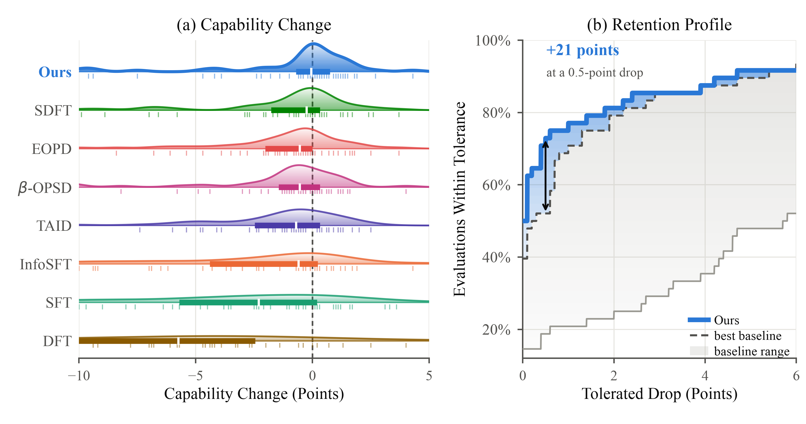
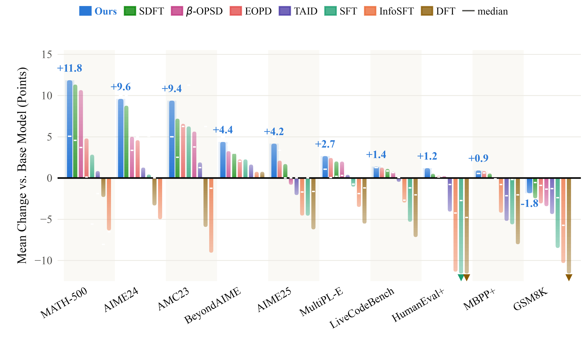

# iSDFT: Information-Proximal Self-Distillation for Continual Learning

iSDFT learns from demonstrations while controlling how much the student moves toward its teacher. We build on on-policy self-distillation fine-tuning: the student generates a response, and a teacher conditioned on a demonstration provides token-level guidance. Instead of always matching the full teacher distribution, iSDFT constructs the closest distribution to the current student that satisfies a teacher-information constraint. A separate KL anchor to the frozen initial model limits drift during training.

This repository contains the iSDFT trainer, the Tool Use and Science datasets, and their task evaluators. The paper is coming; we will add the arXiv link and citation here when it is available.

## Trained checkpoints

Our trained checkpoints and evaluation JSONs are available in the [iSDFT collection on Hugging Face](https://huggingface.co/collections/KickItLikeShika/isdft-info-proximal-self-distillation-fine-tuning). Open a checkpoint's **Files and versions** tab to browse its weights and evaluation results.

## Results

Across four backbones and two specialisation tasks, iSDFT improves on SDFT in seven of eight settings and matches it in the remaining one.

[](assets/figures/fig_L_combined.pdf)

On the six-benchmark retention suite, 73% of iSDFT evaluations score no more than 0.5 percentage points below the base model, compared with 52% for the strongest baseline at that tolerance. Each method contributes 48 evaluations: four backbones, two training tasks, and six benchmarks. Positive changes count as retained.

[](assets/figures/fig3_benchmarks.pdf)

On the ten additional mathematics and coding benchmarks, iSDFT has the largest mean change from Base on every benchmark, averaged over the eight model–task settings. This does not mean every score improves: GSM8K still declines on average. In both figures, **Ours** denotes iSDFT.

## Setup

Use Python 3.12 and a CUDA GPU setup supporting BF16. Training uses colocated vLLM generation and keeps a student, an EMA teacher, and a frozen base model in memory, so allow substantial GPU memory for the chosen backbone.

Run the commands below from the repository root; dataset paths are relative to it.

```bash
python3 -m venv envisdf
source envisdf/bin/activate
pip install -r requirements.txt
```

The training and evaluation splits are already under [`data/`](data/), stored in Hugging Face Datasets format and loaded with `load_from_disk`.

## Training

Tool Use:

```bash
python main.py \
  --model_name Qwen/Qwen2.5-7B-Instruct \
  --dataset_name tooluse \
  --output_dir outputs/qwen25-tooluse \
  --learning_rate 2e-5 \
  --num_train_epochs 4
```

Science:

```bash
python main.py \
  --model_name Qwen/Qwen2.5-7B-Instruct \
  --dataset_name science \
  --output_dir outputs/qwen25-science \
  --learning_rate 2e-5 \
  --num_train_epochs 4
```

These commands use the current defaults in [`main.py`](main.py)

| Argument | Default | Meaning |
| --- | --- | --- |
| `--rho_schedule` | `linear` | Increase the information budget from `rho_min` to `rho`. |
| `--rho_min` | `0.25` | Initial information budget. |
| `--rho` | `1.0` | Final information budget. |
| `--rho_ramp_steps` | `150` | Optimizer step at which the linear ramp finishes. |
| `--rho_bisection_iters` | `40` | Bisection iterations for the per-token target. |
| `--anchor_mu` | `2e-3` | Weight of the forward KL anchor to the initial model. |
| `--ref_model_mixup_alpha` | `0.01` | Student weight in the teacher EMA update, applied every step. |
| `--num_prompts_per_batch` | `32` | Gradient accumulation steps; 32 prompts per optimizer step on one GPU. |
| `--seed` | `42` | Training and dataset shuffle seed. |

The script uses forward KL distillation, a cosine learning-rate schedule with 10% warmup, and maximum prompt and completion lengths of 1,024 tokens each. These settings are configured in `main.py`; further trainer options are defined in [`distil_config.py`](distil_config.py). `--max_steps` overrides the epoch count when positive.

Checkpoints are saved every 100 optimizer steps under `outputs/<run>/checkpoint-<step>`. Use a saved checkpoint directory for evaluation.

## Evaluation

Replace `checkpoint-100` below with the checkpoint you want to evaluate.

```bash
python eval_tooluse.py \
  --model_path outputs/qwen25-tooluse/checkpoint-100 \
  --output_dir results/qwen25-tooluse

python eval_science.py \
  --model_path outputs/qwen25-science/checkpoint-100 \
  --output_dir results/qwen25-science
```

Both evaluators use vLLM and write `eval_results.json` (accuracy, per-example scores, and configuration) and `eval_responses.json` (generated responses and references).

For capability retention, evaluate the initial model and the specialised checkpoint with identical benchmark settings, then report the difference in percentage points. The requirements include a pinned revision of [lm-evaluation-harness](https://github.com/EleutherAI/lm-evaluation-harness) and EvalPlus.

## Acknowledgements

Our implementation builds on [Self-Distillation Fine-Tuning](https://github.com/Continual-Intelligence/Self-Distillation) and [TRL](https://github.com/huggingface/trl). The Tool Use and Science data and task evaluation code come from the SDFT project.
